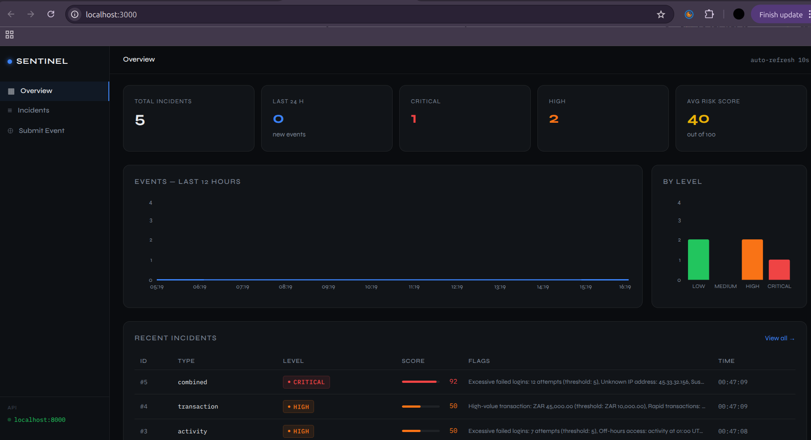
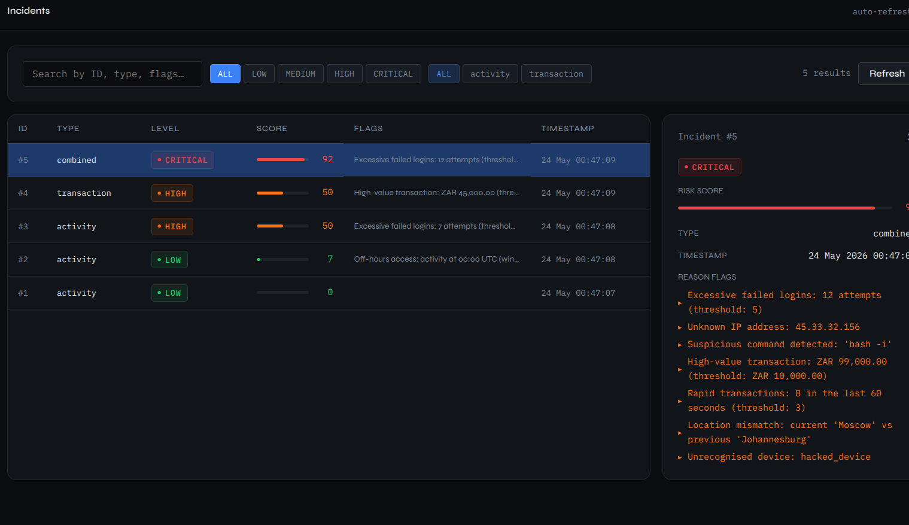

# 🛡 Sentinel
**Security Monitoring & Fraud Detection System**

Built by Keletso Monyamane · MIT License · Python 3.11+ · FastAPI · SQLite · React

---

## Screenshots

### Dashboard Overview



### Incidents Detail Panel


---

## What Is Sentinel?

Sentinel is a dual-module detection system that watches for suspicious behaviour across two domains simultaneously — system activity and financial transactions. Both modules feed into a Central Risk Engine that produces a unified risk score (0–100), alert level, reason flags, and a persistent incident log for every event. A React dashboard provides a live ops view into everything.

---

## Features

| Feature | Status |
|---|---|
| Activity Detector | Done |
| Transaction Scorer | Done |
| Central Risk Engine | Done |
| Alert Handler (console + NDJSON log) | Done |
| SQLite persistence | Done |
| Unit tests (39 tests) | Done |
| FastAPI REST API | Done |
| React dashboard (overview, incidents, submit events) | Done |
| swagger/OpenAPI |  Done |
| Email / SMS alerts (Twilio) |  In progress |
| Event simulator/agent | planned |
| Event correlation | planned |
| Better risk explanations | planned |
| Aunthentication/ authorization | planned |
| user/entity history | planned |
| Search/filter events | planned |
| Severity workflow | planned |
| Rate limiting | planne |
| Intergration tests | planned |
| Apache Kafka event pipeline |  Planned |
| ML scoring layer |  Planned |
| API rate limiting  |  Planned |
| prometheus metrics |  Planned |


---

##  Quickstart

### Backend

```bash
# 1. Clone and create virtual environment
git clone https://github.com/keletso-m/Security-monitoring-and-Fraud-Detection-System.git
cd Security-monitoring-and-Fraud-Detection-System
python -m venv venv
source venv/bin/activate      # Windows: venv\Scripts\activate

# 2. Install dependencies
python -m pip install -r requirements.txt

# 3. Initialise the database
python scripts/init_db.py

# 4. Start the API server
PYTHONPATH=$(pwd) uvicorn app.main:app --reload
```

API runs on **http://localhost:8000** — visit **/docs** for the interactive explorer.

### Dashboard

```bash
# In a second terminal
cd frontend
npm install
npm start
```

Dashboard runs on **http://localhost:3000**

### Fire test data

```bash
# In a third terminal
PYTHONPATH=$(pwd) python simulator/run.py
```

Fires 5 synthetic scenarios through the full pipeline (🟢 LOW → 🔴 CRITICAL). Results appear live in the dashboard.

---

##  Tests

```bash
pytest tests/ -v
```

**39 passed, 0 failed**

Covers all 4 activity signals, all 4 transaction signals, risk engine blending, combined signals, and full pipeline integration.

---

##  API

| Method | Endpoint | Description |
|---|---|---|
| GET | `/` | Service status |
| GET | `/health` | Liveness check |
| POST | `/events/activity` | Submit a system activity event |
| POST | `/events/transaction` | Submit a transaction event |
| GET | `/incidents` | List incidents (supports `?limit=` and `?min_score=`) |
| GET | `/incidents/{id}` | Get one incident by ID |

---

##  Project Structure

```
sentinel/
├── app/
│   ├── main.py                   # FastAPI entry point + CORS + lifespan
│   └── routes/
│       ├── activity.py           # POST /events/activity
│       ├── transactions.py       # POST /events/transaction
│       └── incidents.py          # GET  /incidents
├── engine/
│   ├── activity_detector.py      # Intrusion detection (4 signals)
│   ├── risk_engine.py            # Score blending, DB writes, incident reads
│   └── transaction_scorer.py     # Fraud scoring (4 signals)
├── alerts/
│   └── alert_handler.py          # Console output + NDJSON log
├── frontend/
│   ├── public/
│   │   └── index.html
│   └── src/
│       ├── App.jsx               # Shell + navigation
│       ├── api.js                # All fetch calls to FastAPI
│       ├── index.js              # React entry point
│       ├── index.css             # Global styles
│       └── components/
│           ├── Overview.jsx      # Stats, charts, recent incidents
│           ├── Incidents.jsx     # Full incident list with filters
│           ├── SubmitEvent.jsx   # Manual event submission + quick scenarios
│           └── ui.jsx            # Shared components (Badge, Card, ScoreBar…)
├── simulator/
│   └── run.py                    # 5 synthetic test scenarios
├── scripts/
│   └── init_db.py                # Safe database initialiser
├── tests/
│   └── test_engine.py            # 39 unit + integration tests
├── db/
│   └── incidents.db              # SQLite — auto-created on first run
├── logs/
│   └── sentinel.log              # NDJSON log — auto-created on first run
├── requirements.txt
└── README.md
```

---

##  Risk Scoring

Transparent, weighted scoring — not a black box. Every score comes with plain-English reason flags.

**Activity signals**

| Signal | Weight |
|---|---|
| Failed logins > 5 | +30 |
| Access between 00:00–05:00 UTC | +15 |
| IP not in known allowlist | +25 |
| Suspicious command detected | +30 |

**Transaction signals**

| Signal | Weight |
|---|---|
| Amount > ZAR 10,000 | +25 |
| 3+ transactions in 60 seconds | +30 |
| Location mismatch from last transaction | +25 |
| New / unrecognised device | +20 |

**Blending** — activity and transaction scores are combined 50/50. A combined signal (both detectors fire) produces a significantly higher score than either alone.

**Alert levels**

| Score | Level |
|---|---|
| 0–24 | 🟢 LOW |
| 25–49 | 🟡 MEDIUM |
| 50–74 | 🟠 HIGH |
| 75–100 | 🔴 CRITICAL |

---

##  Design Decisions

**Why rule-based scoring instead of ML?** Rules are transparent, debuggable, and explainable which matters in security. An ML layer is planned for v2 on top of a working, auditable baseline.

**Why SQLite?** Zero infrastructure to run locally. The DB layer is abstracted in `risk_engine.py` so PostgreSQL is a config change, not a rewrite.

**Why a unified risk engine?** A combined signal is more actionable than two separate alerts. A user flagged by both detectors simultaneously is a much stronger indicator than either alone Scenario 5 in the simulator scores 92/100 for exactly this reason.

**Why separate frontend and backend?** The React app talks to FastAPI via a REST API, keeping the two independently deployable. The `proxy` field in `package.json` handles CORS in development in production you'd put both behind a reverse proxy like nginx.

---

## Screenshots 


## License

MIT — use it, extend it, learn from it.

---

*Built by Keletso Monyamane — [github.com/keletso-m](https://github.com/keletso-m)*
